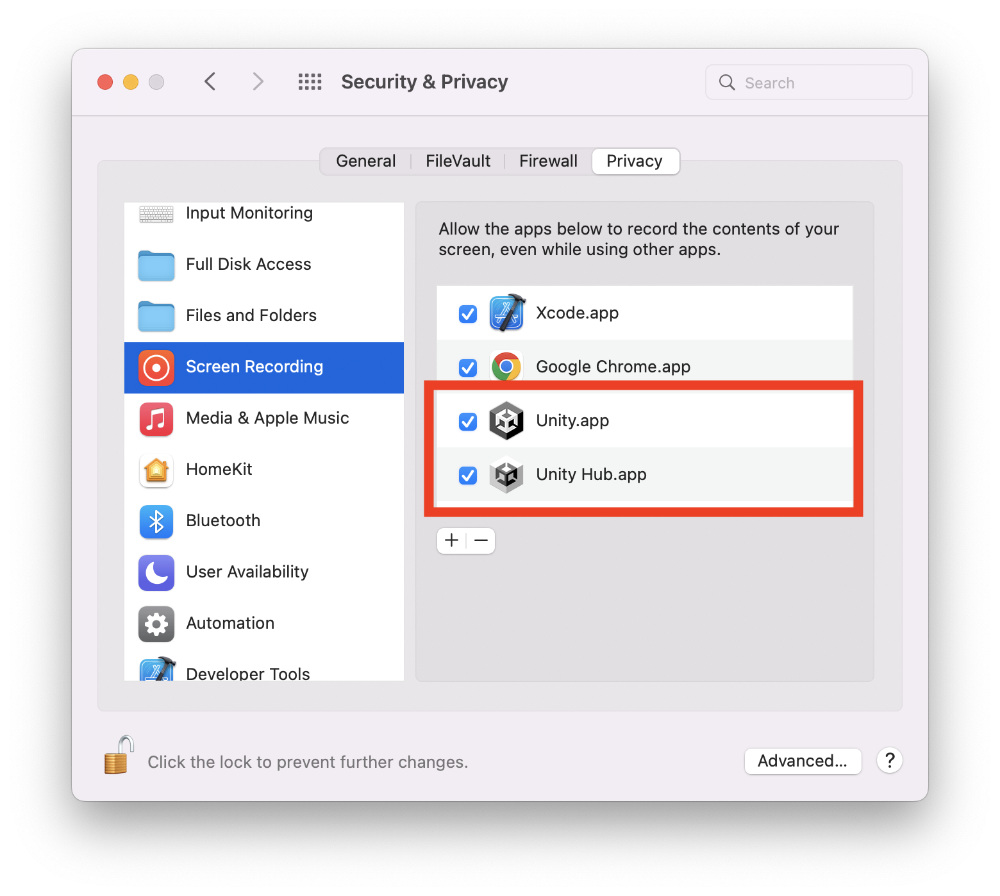

# mcDesktopCapture


Unity native plugin to capture the macOS desktop as Texture2D

<video src="https://user-images.githubusercontent.com/33706353/180478830-64fae2ab-321e-4d88-9eb6-b6dfc121da31.mp4"></video>

# Installation
* Download mcDesktopCapture.unitypakcage from [Releases](https://github.com/fuziki/mcDesktopCapture/releases) and install it in your project.
* To allow monitoring of keyboard input in the background, you need to add Unity to Privacy Settings.  
* Open `System Preferences` > `Security & Privacy` > `Privacy` > `Screen Recording` and add `Unity.app`.  
  (And `Unity Hub.app` if you use)  



# Usage

|   | mcDesktopCapture | mcDesktopCapture2 |
| :--- | :--- | :--- |
| Unity | Unity 2021.X<br>Unity 2022.X<br>Unity 2022.2+ (Apple Silicon) | Unity 2021.X<br>Unity 2022.X<br>Unity 2022.2+ (Apple Silicon) |
| Platform | macOS 12+ (Apple Silicon and Intel) | macOS 12.3+ (Apple Silicon and Intel) |
| Technology | [Quartz Display Services](https://developer.apple.com/documentation/coregraphics/quartz_display_services) | [ScreenCaptureKit](https://developer.apple.com/documentation/screencapturekit) |
| Capturing | Entire Display | Each windows |

## mcDesktopCapture

* Support macOS 12+
* Based on [Quartz Display Services](https://developer.apple.com/documentation/coregraphics/quartz_display_services)
* This function only supports capturing the entire display.

### Start capture

```c#
var list = DesktopCapture.DisplayList;
DesktopCapture.StartCapture(list[0].id);
```

### Set Texture

```c#
var texture = DesktopCapture.GetTexture2D();
if (texture == null) return;
Renderer m_Renderer = GetComponent<Renderer>();
m_Renderer.material.SetTexture("_MainTex", texture);
```

### Stop capture

```c#
DesktopCapture.StopCapture();
```

## mcDesktopCapture2

* Support macOS 12.3+
* Based on [ScreenCaptureKit](https://developer.apple.com/documentation/screencapturekit)
* This feature is able to capture each window.

### Start capture

```c#
DesktopCapture2.Init();
var list = DesktopCapture2.WindowList;
var window = list[0];
DesktopCapture2.StartCaptureWithWindowID(window.windowID, window.frame.width, window.frame.height, true);
```

### Set Texture

```c#
var texture = DesktopCapture2.GetTexture2D();
if (texture == null) return;
Renderer m_Renderer = GetComponent<Renderer>();
m_Renderer.material.SetTexture("_MainTex", texture);
```

### Stop capture

```c#
DesktopCapture2.StopCapture();
DesktopCapture2.Destroy();
```
